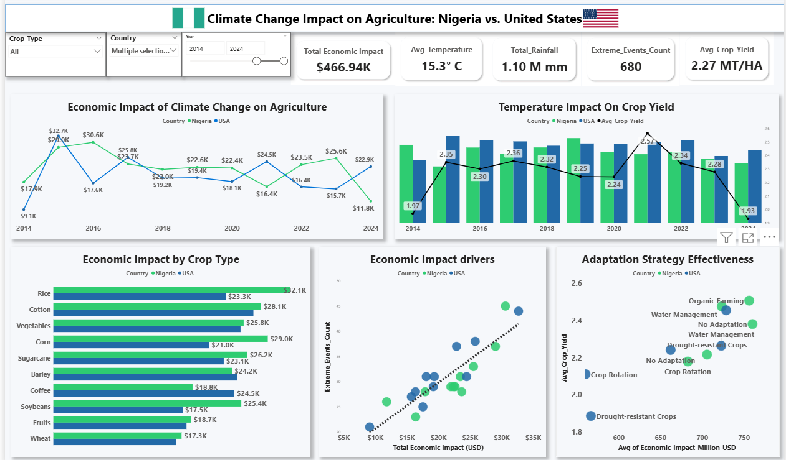
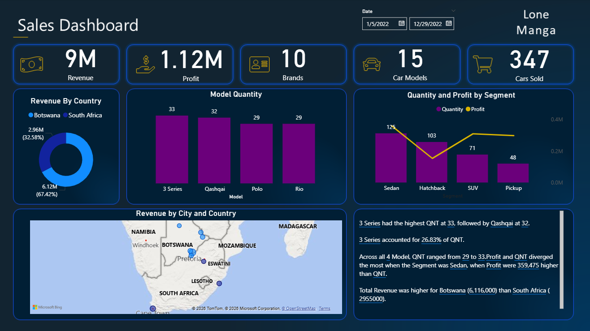

# Profile
Hello world! My name is Lone, a determined and proficient Information Technology professional with strong expertise in data analytics demonstrating a strong ability to interpret business requirements into actionable insights, optimize reporting processes and improve data accuracy and efficiency across organizational workflows. Experienced with sales, medical, education, finance and operations, I help businesses understand it's challenges to unlock growth. 

# What i do

**- ✅ Data Cleaning**
Transform raw data into manageable forms.
**- ✅ Data Analytics**
I provide in-depth analysis and tailored solutions to help you make data-driven decisions, optimize processes, and drive business growth.
**- ✅ Stakeholder communication**
Prepare presentations and reports.

# My Portfolio Projects

## Team projects
### Problem
Climate change and extreme weather events pose a threat to global food security, leading to unstable crop yields and massive economic losses in the agricultural sector worldwide.

<!-- ### Objectives
To identify the main factor diving economic losses
To Identify crops most vulnerable to climate change effects
Identify which climate adaptation strategies (e.g., Water Management, Drought-resistant Crops) are most effective: 
Comparing Nigeria vs. United States
To assess if climate adaptation strategies can be transferred across different countries, for example: can we apply what works for Nigeria in the United States?
-->

### Insights and Conclusion

Strategies to combat climate impact should prioritize protecting vulnerable crops
Extreme weather events is the main driver of financial loss in the agriculture sector 
Any policy or adaptation strategy that can reduce the frequency of these events or mitigate their damage will reduce financial losses
Climate adaptation strategies are context specific but some are transferable (water Management)
Achieving Zero Hunger - focus on strategies that boost yield (Water Management) and reduce financial volatility (Crop Rotation)

<tr>
      <td>⬇️</td>
      <td><a href="https://github.com/keloman17/group-projects">Read More</a></td>
    </tr>
    

## Individual projects
### Business Case
Make a sales analysis for Exhodus cars and develop a data analysis tool for our company sales.

### Objectives
1. Present revenue by country (ZA/BW)
2. Identify top 3 cars sold
3. Compare profit * sales Quantity between the car segments
4. Visualize Revenue by City
<tr>
      <td>⬇️</td>
      <td><a href="https://github.com/keloman17/PowerBI-With-AI">Read More</a></td> 
</tr>   

